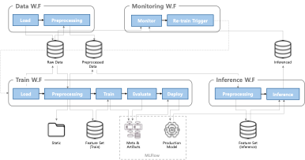

# MLOps

## 1. 템플릿 가이드라인
### 1.1. Root
  - artifacts: 프로젝트 별 실험에 대한 artifact 저장 경로. S3 스토리지 사용시 설정된 Bucket에 저장 됨.
  - compose: Airflow, MLFlow, S3 Storage에 대한 URL 및 credential 정보 & 프로젝트에 대한 config.
  - dags: Airflow 기반 워크플로우
  - db_handler: 데이터 및 모델 메타 데이터 처리를 위한 SQLite 기반의 처리 기능
  - messenger: Slack 메시징을 위한 기능
  - service: 모델 관리 및 배포를 위한 기능
  - crypto_forecast: 프로젝트 폴더. 프로젝트 추가 생성시 Root에 폴더 생성 후 <u>*"1.2. Project 생성 가이드라인"*</u>에 따라 구성 필요.

### 1.2. Project
  - configs: 프로젝트의 필요 설정 값들을 관리하는 파일로 구성.
  - core: Task 단위로 구분된 파일로 구성. 각 task에 필요한 기능들은 함수 형태로 task와 유사한 이름의 폴더에서 관리.     Ex) prj_name/core/train.py에서 필요한 기능 및 함수는 prj_name/core/trainer 폴더에 구성
  - loader, preprocessor, trainer, evaluator: core 내 task에 필요한 기능으로 구성된 파일. class는 사용하지 않고 단일 함수로 작성. 함수명이 중복되지 않게 주의.
  - logs: Task 실행 시 기록되는 log 파일 저장 경로
  - static: 자주 변경되지 않는 처리된 산출물. 실행 및 배포 시 일관성과 재현성을 보장하기 위한 파일.
  - run.py: core의 각 task를 호출하여 단계별로 실행하는 최종 실행 파일.
